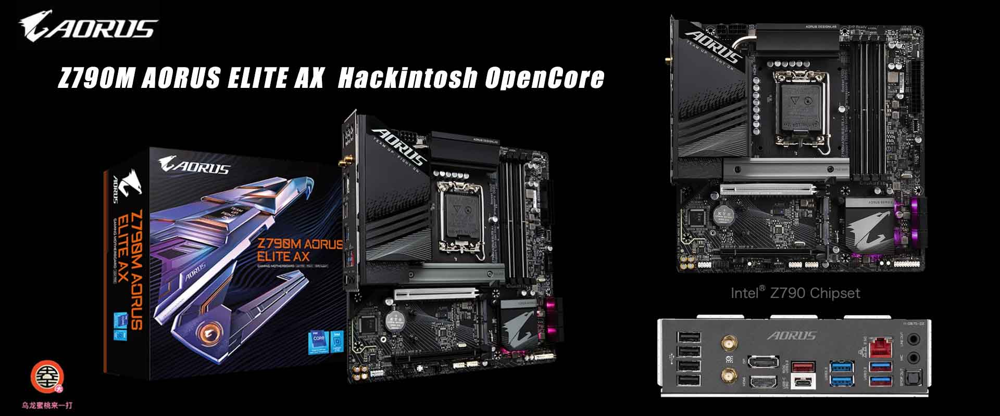

# Gigabyte Z790M AORUS ELITE AX Hackintosh OpenCore EFI



### [简体中文](README.zh_CN.md)

### OpenCore

[OpenCore 1.0.4](https://github.com/acidanthera/OpenCorePkg)

### OS Version Tested

- macOS Monterey 12.x
- macOS Ventura  13.x 
- macOS Sonoma  14.x 
- macOS Sequoia  15.x


### Hardware

- BIOS Version: F5  2023-08-28
- Motherboard: Gigabyte Z790M Aorus Elite AX
- CPU: Intel 13th i5-13600KF
- GPU: Gigabyte Radeon RX 6600 EAGLE 8G
- Memo: SAMSUNG  32G（16G*2）DDR5 5600 Mhz B-die
- SSD:  Intel S4520 960G Windows 11
- SSD:  Intel S4520 960G MacOS Sonoma
- HDA: Realtek ALC1220
- LAN: Realtek RTL8125 2.5GB
- WiFI: Intel AX211

### BIOS

```

Settings
  |-- IO Ports
      |-- Above 4G Decoding: Enabled
      |-- IOAPIC 24-119 Entries: Disabled
      |-- Super IO Configuration
          |-- Serial Port: Disabled
      |-- USB Configuration
          |-- XHCI Hand-off: Enabled 
          |-- Port 60/64 Emulation: Disabled
      |-- SATA Configuration
          |-- SATA Controllers): Enabled 
  |-- Miscellaneous 
      |-- VT-D: Enabled    
Boot 
  |-- CFG Lock: Disabled
  |-- Fast Boot: Disable Link
  |-- CSM Support: Disabled
  |-- Secure Boot
      |-- Secure Boot: Disabled
```

### Notes

 - Use  [OCAuxiliaryTools](https://github.com/ic005k/OCAuxiliaryTools/releases) build your SMBIOS
 - If you want to use a CPU without  Efficient-Core, you must uncheck the option in the config.plist file Kernel--ProvideCurrentCpuinfo
 - Use the Power button to wake up from sleep
 - Intel AX211 WiFi driver ([AirportItlwm.kext](https://github.com/OpenIntelWireless/itlwm/releases) in this EFI is only applicable to MacOS 15 Sequoia with OCLP. Please download and replace this driver yourself when installing other MacOS versions
 - Intel AX211 Not Supported  Airdrop


### Contact Us 

- QQ Group: 23304408

